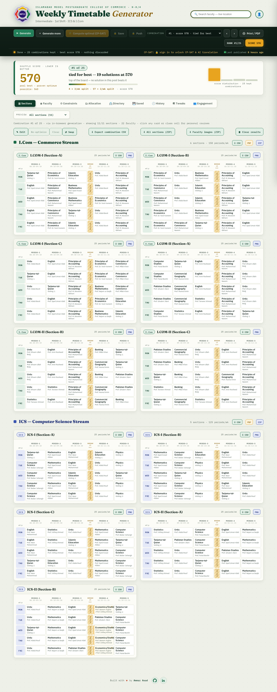
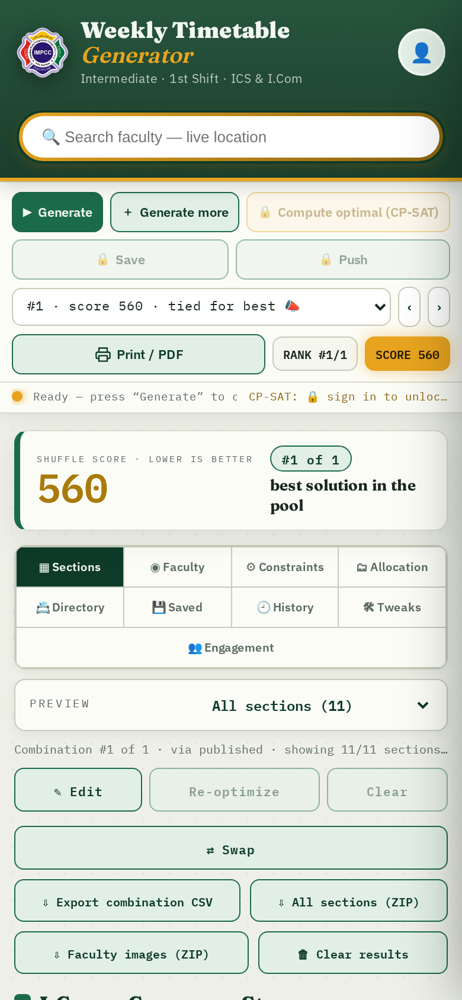
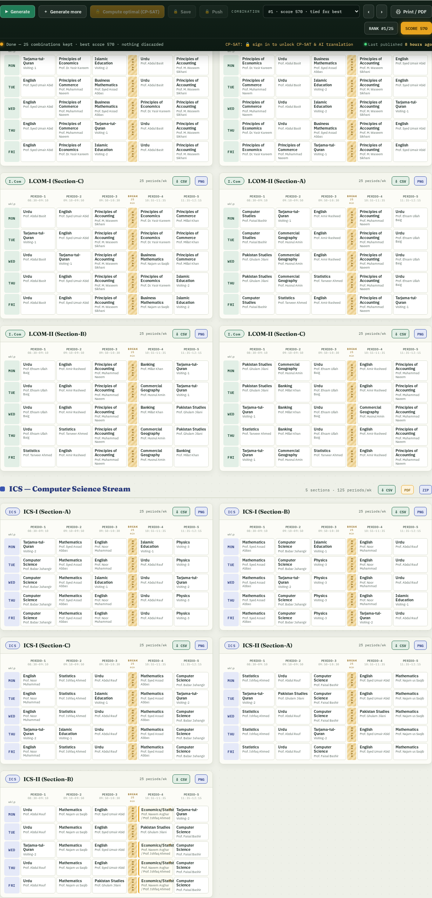
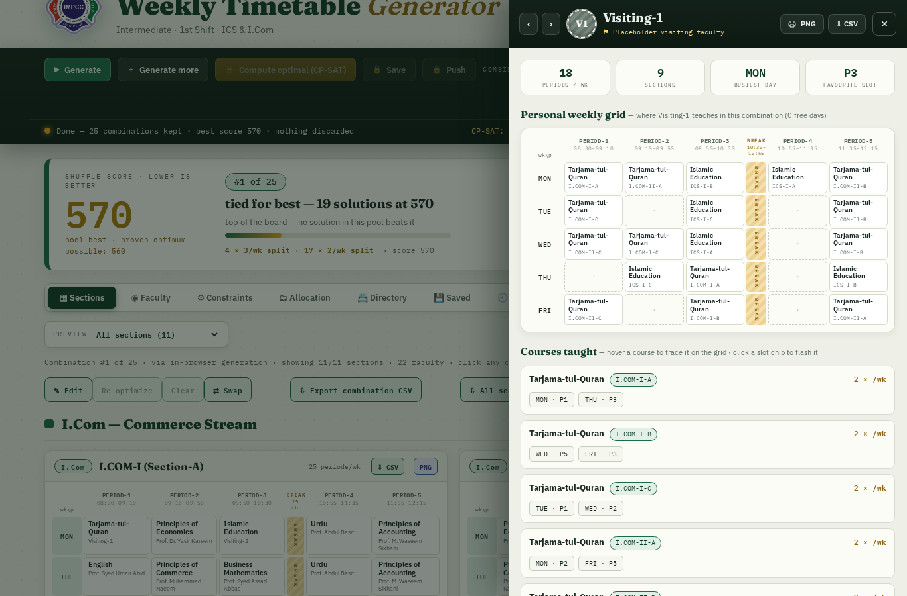
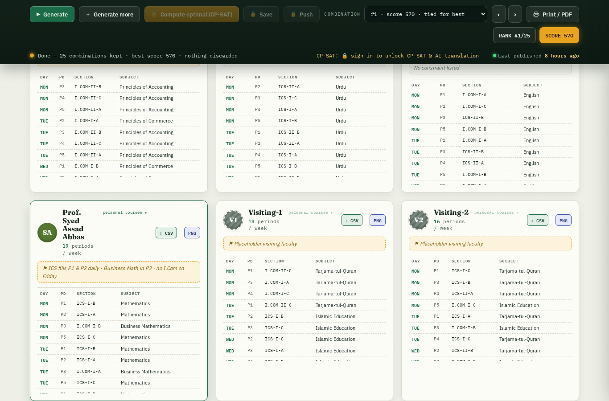
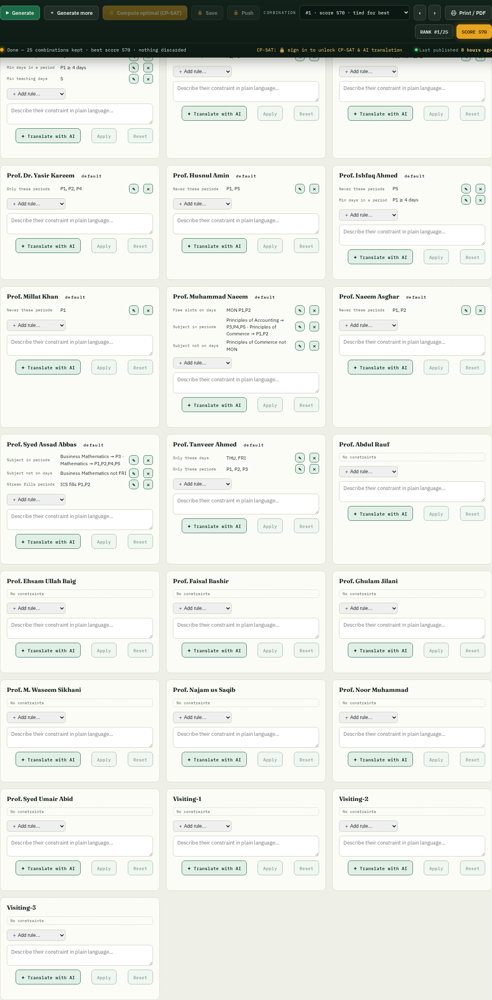
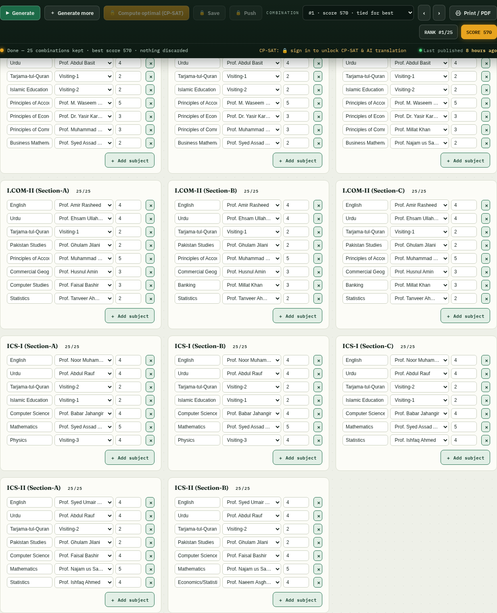
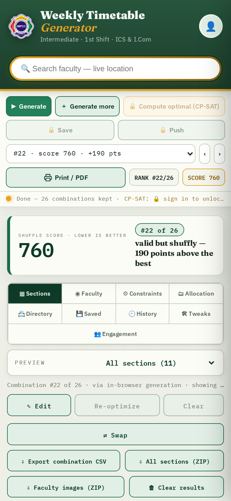
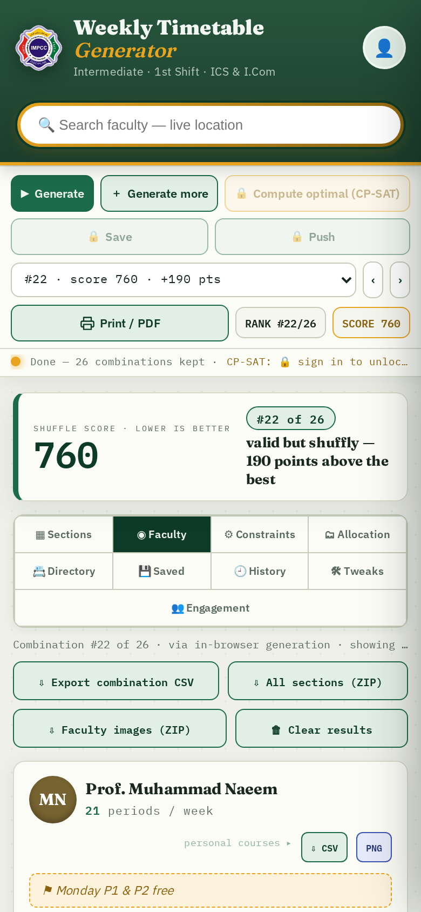

<div align="center">


# IMPCC · Weekly Timetable Generator

**Islamabad Model Postgraduate College of Commerce (H-8/4)** — Intermediate · 1st Shift · ICS &amp; I.Com

A production timetable generator for the college's **three timetable populations** — **Intermediate 1st Shift**, **BS Departments 1st Shift** (solved jointly: one teacher pool, zero cross-level clashes) and **Intermediate 2nd Shift** (an independent system) — turning faculty constraints, course allocations and institution-level general instructions into clash-free weekly schedules with documented soft-constraint violations.

<br/>

[](https://impcc-timetable-generator.vercel.app)
[](README.md)
[](README.md)
[](README.md)

</div>

---

> **A one-page timetable for the whole college.** Every section gets a full 25-period week (Mon–Fri · P1–P5, with a break between P3 and P4), every teacher is in exactly one room at a time, every faculty member's personal constraints are honoured — and the result can be saved, versioned, pushed to every device, printed, or exported as images.

<br/>

## 📸 The app in context

<table>
  <tr>
    <td width="50%"></td>
    <td width="50%"></td>
  </tr>
  <tr>
    <td align="center"><sub><b>Desktop</b> — header, controls, scorecard and the I.Com/ICS sections grids</sub></td>
    <td align="center"><sub><b>Mobile</b> — compact header, faculty search, controls and scorecard</sub></td>
  </tr>
</table>

<table>
  <tr>
    <td width="50%"></td>
    <td width="50%"></td>
  </tr>
  <tr>
    <td align="center"><sub><b>Sections</b> — the 5×5 weekly grid, colour-coded by stream</sub></td>
    <td align="center"><sub><b>Faculty spotlight</b> — a teacher's personal weekly timetable</sub></td>
  </tr>
</table>

<details>
<summary><b>More screenshots — Faculty · Constraints · Allocation · Mobile</b></summary>
<br/>
<table>
  <tr>
    <td width="50%"></td>
    <td width="50%"></td>
  </tr>
  <tr>
    <td align="center"><sub><b>Faculty</b> — every teacher's load and schedule at a glance</sub></td>
    <td align="center"><sub><b>Constraints</b> — faculty rules as data, editable per member</sub></td>
  </tr>
</table>
<table>
  <tr>
    <td width="50%"></td>
    <td width="50%"></td>
  </tr>
  <tr>
    <td align="center"><sub><b>Allocation</b> — subjects, teachers and periods per section</sub></td>
    <td align="center"><sub><b>Mobile sections</b> — the same grids, touch-optimised</sub></td>
  </tr>
</table>
<div align="center">
  
  <br/><sub><b>Mobile faculty</b> — one-column cards on a phone</sub>
</div>
</details>

---

## ✨ What it does

| | |
|---|---|
| ▶ **Generate** | A randomized backtracking solver builds valid weeks live in the browser — nothing is precomputed. |
| ✦ **Compute optimal (CP-SAT)** | A proven-optimal backend (OR-Tools CP-SAT on Vercel) finds the mathematically best schedules — score **560** — and merges them into the pool. |
| 🔢 **Combination pool** | Every distinct valid timetable is kept, ranked by shuffle score, and switchable with ‹ ›. Nothing is ever silently dropped. |
| 🧭 **Nine views** | Sections · Faculty · Constraints · Allocation · Directory · Saved · History · Tweaks · Engagement. |
| 📣 **Publish** | Push **one timetable per population** so every visitor sees it without signing in; unpush removes it again. |
| ⚡ **Simulation mode** | Evaluate *hypothetical* faculty constraints against the selected combination — real constraints untouched, verdicts per teacher, apply or discard. |
| 📋 **Instructions** | Institution-level general instructions as admin-managed data: structured rule editors, NL→AI translation, per-population publish. |
| 🔒 **Locks** | Cell, day and section locks + re-optimize around them. |
| ⚑ **Documented violations** | Solutions that must disobey soft constraints (physically unavoidable) carry itemized violation reports + penalties; the pool rule shows ≥10 valid, or pads with documented violators. |

## 🎯 The score

Lower is better — it measures **how much a subject shuffles between period slots across the week**.

| Subject load | Penalty per extra slot |
|---|---|
| 5 / week | 100,000 (always avoided) |
| 4 / week | 10,000 |
| 3 / week | 100 |
| 2 / week | 10 |

The **legacy dataset's proven optimum is 560** (its regression fixture). The 2026-27 multi-population dataset is structurally denser (day+slot bans force some 5/wk splitting) — its score compares solutions within the dataset, plus itemized soft-penalty totals.

## 🛠 Adjusting the timetable

- **Tweaks** — teacher unavailability, permanent / temporary (date window) / recurring. Expired temporary tweaks revert automatically.
- **✎ Edit mode** — click any cell to *force* a subject+teacher or *remove* a lecture, then **Re-optimize** keeps every edit while rebuilding the week.
- **⇄ Swaps** — drag cells into **perfect circles** (a→b→c→a). Live disruption count (vacancies, conflicts, double-bookings) with a **targeted optimization** that closes incomplete chains using the fewest extra cells.
- **👥 Engagement** — when a teacher is away, a deterministic substitute engine finds an *engaging professor* for each affected period — one who has **no class of his own** there and **satisfies his own constraints** — output as a printable **statements stack**, never merged into the regular grids.

## ✍ Manual build (insights + targeted repair)

- **Per-shift entry** — the **✍ Manual** view gives a fully empty template covering the *whole shift* (1st shift: Inter + BS jointly; 2nd shift: Inter only). Every cell is a picker limited to that section's **allocated subject+teacher pairs**, with weekly quotas shown inline and off-days locked.
- **🔍 Insights from timetable** — one click asks the backend to audit the entered grid as one shift. Every hard clash (double-booked teacher, off-day class, load drift, combined-class misalignment, …) and every soft warning becomes a card with its exact cause.
- **🎯 Targeted repair** — each card offers **Fix this** and **Fix all like this**. CP-SAT then re-solves with every uninvolved cell **pinned to where the admin put it** (strict → local → open tiers), so the fix touches the fewest cells mathematically possible. Physically-forced causes (e.g. Babar P5) report honestly instead of promising a fix.
- Once the analysis is clean, **✔ Adopt** adds the result to the pool as a normal combination — save, push, export, and history all work unchanged. Drafts autosave per shift in the browser.
- **📋 General Instructions page** — the per-rule **✕ Remove** and **on/off** controls now actually take effect (local draft → **☁ Publish** to sync), and the sections grid renders combinations that predate the joint shift context with a clear *coverage note* instead of stalling on the previous population's cards.
- **🌗 Themes (dark mode + palettes)** — a masthead picker offers **Classic** (default light), **Midnight** and **Forest** (dark), **Sand** (light sepia), and **System** (follows the OS dark/light setting automatically). The chosen palette applies before first paint (no flash), is remembered per browser (localStorage only — no account needed), and printing always uses the classic light palette regardless of theme.
- **⚖ Fairness scorecard** — every combination shows its **exact per-side decomposition**: the Inter-side and BS-side components of the joint shuffle score (the score is additive per section, so the two parts always sum exactly to the joint figure), each annotated with its **share of that side's standalone best** (Inter / BS solved *alone* by CP-SAT — served fingerprinted from `GET /score-references`, baked at `data/score_references.json`). It also shows the **coexistence total** (= joint score + documented penalties) and keeps the rules-obedience pen­alty visible. Ranking semantics are unchanged: the pool still orders by validity, then total. A combination whose parts cannot reconcile with its stored score shows no split rather than a wrong one.

## 💾 Save · Version · Push

- **Originals** are saved from the main page. **Load** one, tweak it, and save it as a **version** (chainable) or **replace the original** (old one archived).
- Versions remember the **edits/tweaks/engagement/swaps** that produced them.
- Deleting a version wipes it, but the **🕘 History** of actions remains — with a clear-history control that removes the log (never the timetables).
- **🗑 Clear results** empties the generated pool on any device; saved & pushed timetables stay.

## 🔐 Auth & sync (Supabase)

- Sign in (top-right avatar) to unlock CP-SAT, AI translation, saving, pushing and tweak management.
- Allocation, constraints, faculty directory and tweaks sync in a **published** record readable by everyone — signed-in edits propagate system-wide.
- Generated pools stay **local** (localStorage); only *saved* timetables live in Supabase.

## 🔍 Faculty search

Type a name in the header and see each teacher's **live location** (which class they're in *right now*, or *Free*), followed by their **upcoming fixtures** — computed from the selected timetable and the current time.

## 📦 Exports

| Export | Format |
|---|---|
| Section | landscape **PNG** |
| Teacher (personal) | **PNG** |
| Stream / whole platform / all faculty | **ZIP** of PNGs — the *all-sections* ZIP also downloads a combined **PDF** laid out in the splitting hierarchy (cover → stream divider → group divider → section pages), and the *faculty* ZIP downloads a combined **PDF** (one member per page). Every page is the image itself. |
| Combination / section / stream / teacher | **CSV** |
| Current view | **Print → PDF** |

Exports carry **only college identity** — no scores, ranks, solver or site/developer info.

## 🚀 Deploy & backend

- **Frontend + API on Vercel** — `api/index.py` (FastAPI) serves the site at `/` and `POST /generate`, `GET /health`, `GET /populations`, `GET /docs`; `vercel.json` bundles the solver modules (`includeFiles`) with a 300 s budget.
- **In-browser solver** — `solver.js` is a faithful JS port of the same model; the site works fully offline-in-browser even without the backend.
- **Timetable grid** — the model reserves a **6-day × 8-period maximum capacity**; the *active* grid (default Mon–Fri × 5) is data, selected via `generate({days, periods})` / `POST /generate {days, periods}` and per-population configs (`populations.js`, `timetable_config.py`). No code change is needed to activate Saturday or extra periods.

## 📁 Repository

| Path | Purpose |
|---|---|
| `index.html` | The functional website (built) |
| `build_frontend.py` | Build script — the single source of truth (`python3 build_frontend.py`) |
| `timetable-generator-UI-prototype.html` | The original client-supplied design prototype |
| `solver.js` / `solver.py` | JS + Python constraint models (grid-parameterized: active days×periods, capacity 6×8) |
| `cp_solver.py` | CP-SAT model (OR-Tools) + `generate_ranked()` API entry point |
| `populations.js` / `timetable_config.py` | Domain model: the three timetable populations (Inter-1st, BS-1st, Inter-2nd) + schedule configs (active days/periods, start times, breaks, per-day overrides) |
| `data/canonical.json` · `data.js` · `canonical.js` / `canonical.py` | **The canonical dataset + model adapters** — faculty directory (44, with aliases), subjects registry, per-population allocations, parallel groups, combined classes, constraints, structured general instructions (see `canonical_model.md`; regenerate `data.js` with `python3 tools/gen_data_js.py`) |
| `context_model.py` · `context_solver.js` | **The context layer** — transforms a solve context into the unit model, evaluates solutions (documented soft violations), pool policy; `context_solver.js` adds the in-browser two-stage search (best-effort; CP-SAT is the reliable path for the full shift-1 density) |
| `populations.js` · `data.js` · `canonical.js` · `context_solver.js` · `context_model.py` · `canonical.py` | **Population layer** — the UI's shift/population switcher, per-population grids & persistence, context-based generation (in-browser engine + `POST /generate-context`), documented soft-constraint violations, the 10/25 pool rule |
| `api/index.py` · `auth_check.py` · `llm_translate.py` | FastAPI backend, auth gate, AI translation |
| `supabase.js` | Dependency-free Supabase client (GoTrue + PostgREST) |
| `constraints_schema.md` · `tweaks_schema.md` · `engagement_schema.md` · `versioning_schema.md` · `swap_schema.md` · `canonical_model.md` | Feature specs |
| `gen_all.py` · `export_xlsx.py` · `metrics.py` · `make_report.py` | Offline pipeline (batch solve → XLSX → report) |
| `assets/` | README screenshots |
| `tests/validate_all.py` | **The final validation suite** — 87 checks: all three populations, cross-shift isolation, capacity/expandability, the 560 regression (`--fast` skips long solves) |

## 🧪 Development

```bash
# Rebuild the frontend after editing build_frontend.py
python3 build_frontend.py

# Offline CP-SAT (proven optimum)
pip install -r requirements.txt
python3 gen_all.py

# Deploy to Vercel (FastAPI framework preset)
vercel deploy --prod
```

---

<div align="center">

<sub>Built with ❤️ by **Ammar Asad** · [GitHub](https://github.com/ammarasad2005/impcc-timetable-generator) · [LinkedIn](https://www.linkedin.com/in/muhammad-ammar-asad)</sub>

</div>
